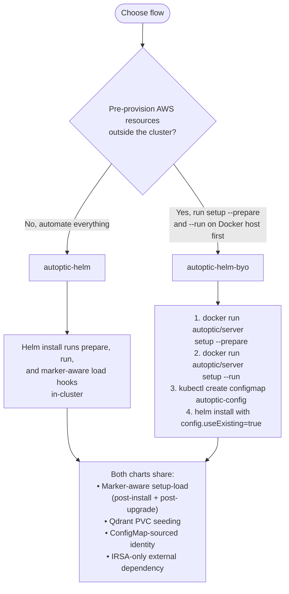

# Autoptic Kubernetes Installation

This directory contains Helm charts for deploying Autoptic on Kubernetes.

## Chart Variants

Two charts are available depending on your preferred AWS resource provisioning workflow:

| Chart | Description | AWS Provisioning |
|-------|-------------|------------------|
| [`autoptic-helm`](./autoptic-helm/) | Automated in-cluster setup | Hooks run `setup --prepare` and `setup --run` in-cluster |
| [`autoptic-helm-byo`](./autoptic-helm-byo/) | Bring-your-own resources | You run `setup --prepare` and `setup --run` via Docker first |

## Decision Flow



## Which Chart Should I Use?

### Use `autoptic-helm` (automated) when:
- You want a single-command deployment
- You want Autoptic to manage AWS resource lifecycle
- You have IRSA configured and want minimal manual steps
- You're comfortable with the chart creating DynamoDB tables and S3 buckets

### Use `autoptic-helm-byo` when:
- You need to pre-provision AWS resources for compliance/audit reasons
- You want to review/validate `config.json` before deploying
- You need to use existing DynamoDB tables or S3 buckets
- You're migrating from a Docker-based deployment and already have AWS resources
- You want to run setup commands in a CI/CD pipeline before Kubernetes deployment

## Prerequisites (Both Charts)

### 1. Kubernetes Cluster
- EKS (recommended for IRSA), or any Kubernetes cluster
- kubectl and helm installed

### 2. IAM Role for IRSA

Both charts use IAM Roles for Service Accounts (IRSA) for AWS authentication. You need an IAM role with the following policy:

```json
{
    "Version": "2012-10-17",
    "Statement": [
        {
            "Effect": "Allow",
            "Action": [
                "dynamodb:DescribeTable",
                "dynamodb:PutItem",
                "dynamodb:GetItem",
                "dynamodb:Query",
                "dynamodb:DeleteItem",
                "dynamodb:ListTables"
            ],
            "Resource": [
                "arn:aws:dynamodb:*:*:table/autoptic-*"
            ]
        },
        {
            "Effect": "Allow",
            "Action": [
                "s3:HeadBucket",
                "s3:PutObject",
                "s3:GetObject",
                "s3:ListBucket",
                "s3:DeleteObject"
            ],
            "Resource": [
                "arn:aws:s3:::autoptic-snaps-*",
                "arn:aws:s3:::autoptic-snaps-*/*"
            ]
        }
    ]
}
```

**For autoptic-helm (automated)**, also include:
- `dynamodb:CreateTable`
- `s3:CreateBucket`

### 3. Trust Policy

The IAM role needs a trust policy allowing the Kubernetes ServiceAccount to assume it:

```json
{
    "Version": "2012-10-17",
    "Statement": [
        {
            "Effect": "Allow",
            "Principal": {
                "Federated": "arn:aws:iam::<account-id>:oidc-provider/<oidc-provider>"
            },
            "Action": "sts:AssumeRoleWithWebIdentity",
            "Condition": {
                "StringEquals": {
                    "<oidc-provider>:sub": "system:serviceaccount:<namespace>:<service-account-name>"
                }
            }
        }
    ]
}
```

## Quick Start

### Automated Flow (`autoptic-helm`)

```bash
cd autoptic-helm

helm upgrade --install autoptic . \
  -n autoptic --create-namespace \
  --set setup.tenantShortName=my-company \
  --set serviceAccounts.s3DynamoDbAccess.roleArn=arn:aws:iam::<account>:role/<role>
```

See [autoptic-helm/README.md](./autoptic-helm/README.md) for full details.

### BYO Flow (`autoptic-helm-byo`)

**Step 1**: Provision AWS resources with Docker

```bash
# Generate config
docker run --rm -v "$PWD:/work" -w /work \
  -e AWS_REGION=us-west-2 \
  autoptic/server:latest \
  setup --prepare mytenant > config.json

# Create AWS resources
docker run --rm -v "$PWD:/work" -w /work \
  -e AWS_REGION=us-west-2 \
  autoptic/server:latest \
  setup --run /work/config.json
```

**Step 2**: Deploy with Helm

```bash
cd autoptic-helm-byo
NS=autoptic-byo

# Patch generated config for Kubernetes DNS (no jq needed)
python3 - <<'PY'
import json
ns = "autoptic-byo"
with open("config.json","r",encoding="utf-8") as f:
    cfg = json.load(f)
cfg["server"]["ui"] = f"http://ui-service.{ns}.svc.cluster.local:8080"
cfg["scheduler"]["api_endpoint"] = f"http://autoptic-byo-api.{ns}.svc.cluster.local:9999/story/ep/default"
cfg["vector"]["embed_url"] = f"http://vectors-service.{ns}.svc.cluster.local:8000"
cfg["vector"]["qdrant_host"] = f"metrics-service.{ns}.svc.cluster.local"
cfg["vector"]["qdrant_port"] = 6334
for section in ("server", "scheduler", "vector", "storage", "aws"):
    if isinstance(cfg.get(section), dict):
        cfg[section].pop("aws_profile", None)
        cfg[section].pop("profile", None)
with open("config.k8s.json","w",encoding="utf-8") as f:
    json.dump(cfg,f,indent=2); f.write("\n")
print(cfg["instance"]["id"])
print(cfg["instance"]["tenant_short_name"])
PY

# Create ConfigMap from generated config
kubectl create namespace "$NS" --dry-run=client -o yaml | kubectl apply -f -

kubectl -n "$NS" create configmap autoptic-config \
  --from-file=config.json=./config.k8s.json \
  --from-literal=AUTOPTIC_INSTANCE_ID="<instance-id>" \
  --from-literal=AUTOPTIC_TENANT_SHORT_NAME="<tenant-short-name>" \
  --dry-run=client -o yaml | kubectl apply -f -

# Install chart
helm upgrade --install autoptic-byo . \
  -n "$NS" --create-namespace \
  --set namespace.name="$NS" \
  --set api.env.awsRegion=us-west-2 \
  --set scheduler.env.awsRegion=us-west-2 \
  --set config.useExisting=true \
  --set ui.gateway.hostnames[0]=autoptic-byo.dev.autoptic.com \
  --set ui.gateway.parentRefs[0].name=shared-gateway \
  --set ui.gateway.parentRefs[0].namespace=nginx-gateway \
  --set serviceAccounts.s3DynamoDbAccess.roleArn=arn:aws:iam::<account>:role/<role>
```

See [autoptic-helm-byo/README.md](./autoptic-helm-byo/README.md) for full details.

## Shared Features

Both charts share these hardened features:

### DynamoDB Schema Verification

A `pre-install,pre-upgrade` hook runs `setup --verify-schema` before any application pods start. It creates or updates DynamoDB tables to match the schema defined in `config.json`, ensuring new tables added between releases are present before the server comes up.

The hook runs at weight `2` in the hook sequence — after master-key generation (`0`) and the PQL hostpath job (`1`), and before `setup --prepare` (`5`) in the automated chart.

**To disable** (e.g. if you manage DynamoDB tables externally):
```bash
helm upgrade --install autoptic . \
  --set setup.verifySchema.enabled=false \
  ...
```

**To run manually without Helm** — three options depending on your environment:

_Option A — kubectl run (in-cluster, uses IRSA):_
```bash
# Extract the current config from the cluster
kubectl -n autoptic get configmap autoptic-config \
  -o jsonpath='{.data.config\.json}' > /tmp/config.json

# Run verify-schema as a one-off pod using the existing service account
kubectl -n autoptic run schema-verify --rm -it --restart=Never \
  --image=autoptic/server:latest \
  --overrides='{
    "spec": {
      "serviceAccountName": "s3-dynamodb-access",
      "containers": [{
        "name": "schema-verify",
        "image": "autoptic/server:latest",
        "args": ["setup", "--verify-schema", "/tmp/config.json"],
        "volumeMounts": [{"name":"cfg","mountPath":"/tmp/config.json","subPath":"config.json"}]
      }],
      "volumes": [{"name":"cfg","configMap":{"name":"autoptic-config"}}]
    }
  }'
```

_Option B — Docker (outside cluster, uses host AWS credentials):_
```bash
# Uses the same flow as: docker compose run --no-deps server setup --verify-schema /server/config.json
docker run --rm \
  -v "$PWD/config.json:/server/config.json:ro" \
  -e AWS_REGION=us-west-2 \
  -e AWS_PROFILE=your-profile \
  -v "$HOME/.aws:/root/.aws:ro" \
  autoptic/server:latest \
  setup --verify-schema /server/config.json
```

_Option C — pure Helm (targeted upgrade, schema hook only):_
```bash
# Runs only the verify-schema pre-upgrade hook; all other hooks and pods are left untouched.
helm upgrade autoptic . -n autoptic --reuse-values \
  --set setup.verifySchema.enabled=true \
  --set setup.prepare.enabled=false \
  --set setup.run.enabled=false \
  --set setup.load.enabled=false \
  --set hooks.masterKey.generate=false
```

_Option D — trigger via Helm upgrade (re-runs all hooks):_
```bash
# Re-runs every pre-upgrade hook including verify-schema, prepare, run, and load.
helm upgrade autoptic . -n autoptic --reuse-values
```

### Marker-Aware Setup Load
A post-install/post-upgrade hook runs `setup --load` to load sample content (environments, PQL queries, briefs). The hook uses a marker ConfigMap (`autoptic-setup-state`) to track completion per instance-id, preventing duplicate loads on reinstalls/upgrades.

### ConfigMap-Sourced Identity
All pods read `AUTOPTIC_INSTANCE_ID` and `AUTOPTIC_TENANT_SHORT_NAME` from the `autoptic-config` ConfigMap via `configMapKeyRef`, ensuring consistent identity across components.

### Qdrant PVC Seeding
The metrics (Qdrant) deployment includes an initContainer that seeds the PVC from image-baked collections on first start, ensuring consistent vector database state.

### IRSA Support
Both charts use IRSA as the primary AWS authentication method. No static AWS credentials are required in the cluster.

## Migration Between Charts

### From Automated to BYO

1. Export existing config:
   ```bash
   kubectl -n autoptic get configmap autoptic-config \
     -o jsonpath='{.data.config\.json}' > config.json
   ```

2. Uninstall automated chart:
   ```bash
   helm uninstall autoptic -n autoptic
   ```

3. Verify AWS resources exist (they were created by the automated chart)

4. Follow BYO deployment steps with the exported `config.json`

### From BYO to Automated

1. The automated chart will reuse existing AWS resources if the `autoptic-instance-id` Secret is present

2. Create the Secret with your existing instance ID:
   ```bash
   INSTANCE_ID="$(jq -r '.instance.id' config.json)"
   kubectl -n autoptic create secret generic autoptic-instance-id \
     --from-literal=instance-id="$INSTANCE_ID" \
     --from-literal=tenant-short-name="mytenant"
   ```

3. Install automated chart with `setup.prepare.enabled=false` to skip config generation

## Architecture

```
┌─────────────────────────────────────────────────────────────────┐
│                     Autoptic Stack                               │
├─────────────────────────────────────────────────────────────────┤
│  ┌──────────────┐  ┌──────────────┐  ┌──────────────┐           │
│  │   API Server │  │   Scheduler  │  │      UI      │           │
│  │   (port 9999)│  │              │  │   (port 8080)│           │
│  └──────┬───────┘  └──────┬───────┘  └──────┬───────┘           │
│         │                 │                  │                  │
│         └─────────────────┬┴──────────────────┘                   │
│                           │                                      │
│                    ┌──────▼──────┐                               │
│                    │autoptic-config│                              │
│                    │  ConfigMap   │                               │
│                    └──────────────┘                               │
│                                                                  │
│  ┌──────────────┐  ┌──────────────┐                               │
│  │   Metrics    │  │   Vectors    │                               │
│  │  (Qdrant)    │  │ (Embeddings) │                               │
│  │  (port 6333) │  │              │                               │
│  └──────────────┘  └──────────────┘                               │
│                                                                  │
│  IRSA ServiceAccount ──► AWS (DynamoDB + S3)                     │
└─────────────────────────────────────────────────────────────────┘
```

## Chart Structure

```
install/kubernetes/
├── autoptic-helm/              # Automated chart
│   ├── Chart.yaml
│   ├── values.yaml
│   ├── README.md
│   ├── templates/
│   │   ├── hooks/
│   │   │   ├── setup-prepare-job.yaml      # Generates config
│   │   │   ├── setup-prepare-rbac.yaml     # RBAC for prepare
│   │   │   ├── setup-run-job.yaml          # Creates AWS resources
│   │   │   ├── setup-load-job.yaml         # Loads sample content (marker-aware)
│   │   │   ├── setup-load-rbac.yaml        # RBAC for load
│   │   │   └── master-key-hook-*.yaml      # Master key generation
│   │   ├── api_deployment.yaml
│   │   ├── scheduler_deployment.yaml
│   │   ├── ui_deployment.yaml
│   │   ├── metrics.yaml                    # Qdrant with PVC seeding
│   │   └── ...
│   └── files/
│       └── config.json                     # Default config template
│
├── autoptic-helm-byo/          # BYO chart (copied from autoptic-helm)
│   ├── Chart.yaml              # Name: autoptic-helm-byo
│   ├── values.yaml             # Defaults: useExisting=true, prepare/run disabled
│   ├── README.md               # BYO-specific documentation
│   └── templates/              # Same as autoptic-helm, minus:
│       └── hooks/              #   - setup-prepare-job.yaml
│                               #   - setup-prepare-rbac.yaml
│                               #   - setup-run-job.yaml
│
└── README.md                   # This file
```

## Troubleshooting

See individual chart READMEs for detailed troubleshooting:
- [autoptic-helm troubleshooting](./autoptic-helm/README.md#troubleshooting)
- [autoptic-helm-byo troubleshooting](./autoptic-helm-byo/README.md#troubleshooting)

Common issues:
- **ConfigMap not found**: Ensure `config.useExisting=true` for BYO, or that prepare hook ran for automated
- **IRSA permissions**: Verify ServiceAccount has `eks.amazonaws.com/role-arn` annotation
- **Load hook skipped**: Check `autoptic-setup-state` ConfigMap; delete to force re-run
- **Schema mismatch on upgrade**: Current server images enforce stricter schema; run `setup --verify-schema` as preflight
- **Docker setup auth errors**: `setup --prepare/--run` requires host AWS credentials (profile mount or env vars)
- **In-cluster AWS profile error**: remove `aws_profile`/`profile` keys from `config.k8s.json`; pods use IRSA, not `~/.aws`
- **Master-key hook upgrade failure**: either pass `ui.secrets.webuiSecretKey` + `ui.secrets.openaiApiKey`, or `--set hooks.masterKey.generate=false` for route-only upgrades

## Contributing

When making changes:
1. Update `autoptic-helm` first (the source of truth)
2. Copy changes to `autoptic-helm-byo` as needed
3. Keep the BYO chart's specializations (removed prepare/run hooks, different defaults)
4. Run `helm lint` and `helm template` on both charts before committing
